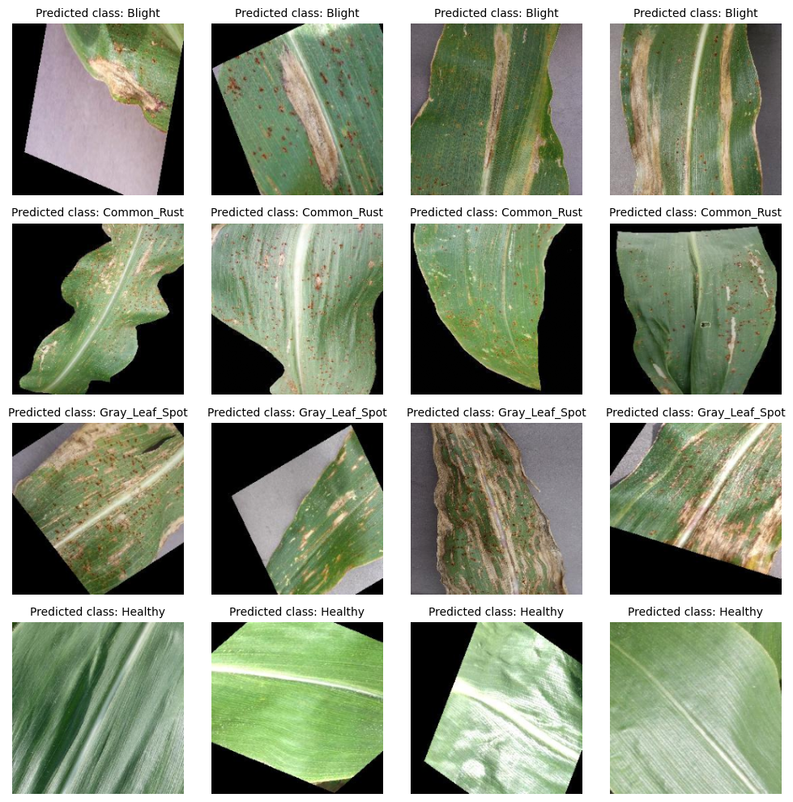
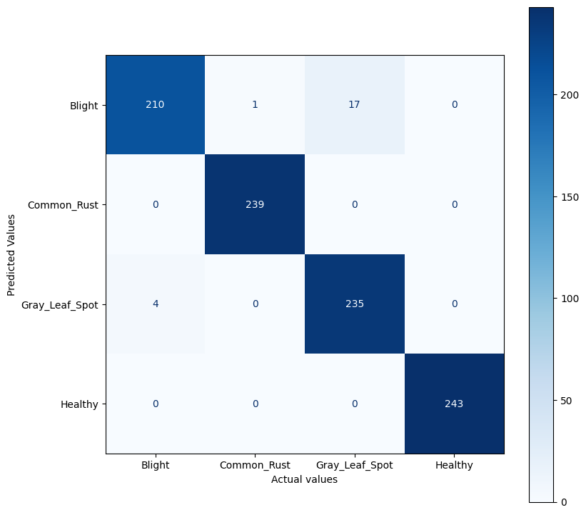
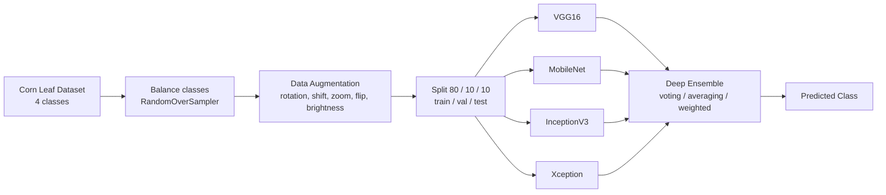
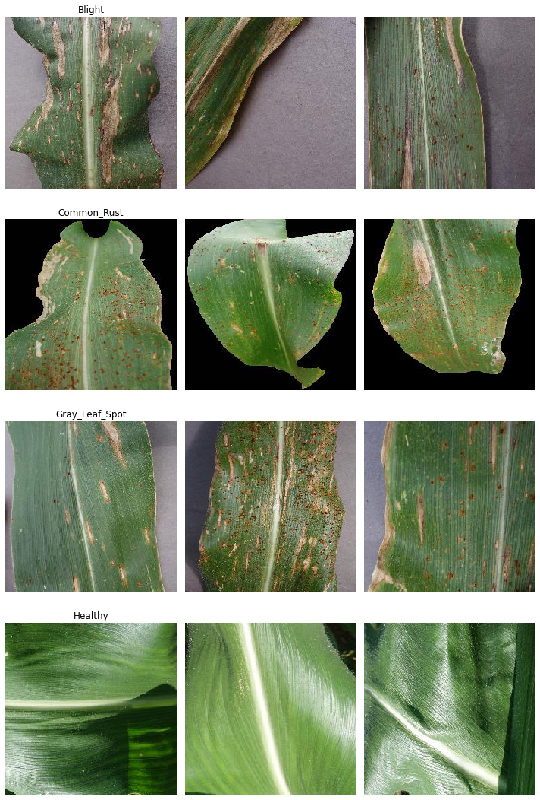

# 🌽 Corn Leaf Disease Classification Using Deep Ensemble Learning

Classifying corn (maize) leaf images into four disease categories using a **deep ensemble** of four pretrained CNNs, reaching **~97% accuracy**. Instead of relying on a single model, the predictions of VGG16, MobileNet, InceptionV3, and Xception are combined so the ensemble is more accurate and more robust than any individual network.




## Overview

Plant diseases are a serious threat to global food security, and diagnosing them by hand is slow and needs an expert eye. This project automates the diagnosis directly from leaf photos. It distinguishes healthy corn leaves from three common diseases (Northern Leaf Blight, Common Rust, and Gray Leaf Spot) using transfer learning, then combines four separate models into a single deep ensemble to push accuracy higher than any one model can reach on its own.

The four classes:

| Class | Description |
| --- | --- |
| 🟤 Blight | Northern leaf blight lesions |
| 🔴 Common Rust | Rust pustules across the leaf |
| ⚪ Gray Leaf Spot | Rectangular gray lesions |
| 🟢 Healthy | No disease present |

## Results

Each base model was trained with transfer learning, then combined using three ensemble strategies. Every ensemble strategy beats the best individual model, and the grid-searched weighted average performs best.

| Model / Strategy | Test Accuracy |
| --- | --- |
| VGG16 | 94.1% |
| MobileNet | 93.3% |
| InceptionV3 | 92.0% |
| Xception | 93.2% |
| Majority Voting | 95.5% |
| Averaging | 96.5% |
| **Weighted Averaging (best)** | **97.6%** |

Confusion matrix for the best ensemble:



## How It Works

The project runs as a four-stage pipeline: prepare the data, train four base learners, then combine them into an ensemble.



**1. Data preparation.** The dataset is small and imbalanced, so classes are balanced with random oversampling and expanded with augmentation (rotation, width and height shifts, brightness, zoom, and flips). The result is split 80/10/10 into train, validation, and test sets.

**2. Base models (transfer learning).** Four ImageNet-pretrained CNNs are used as frozen feature extractors, each with a lightweight classification head: `GlobalAveragePooling2D → Dense(128, ReLU) → Dropout(0.5) → Dense(4, Softmax)`. Images are resized to 224x224, trained with the Adam optimizer and categorical cross-entropy.

**3. Deep ensemble.** The four trained models are combined using three strategies:
- **Majority voting**: each model votes, the majority class wins.
- **Averaging**: class probabilities are averaged across models.
- **Weighted averaging**: models are weighted by contribution, with the best weights found through a grid search.

Ensembling reduces overfitting and improves generalization, which is why the combined model outperforms every individual network.

## Tech Stack

- **Language**: Python
- **Deep Learning**: TensorFlow, Keras
- **Image Processing**: OpenCV, Pillow
- **ML Utilities**: scikit-learn, imbalanced-learn
- **Visualization**: Matplotlib, Seaborn
- **Environment**: Jupyter Notebook, Google Colab

## Repository Structure

```
Corn-Leaf-Disease-Classification/
├── notebooks/
│   ├── 01_data_preparation.ipynb     # load, balance, augment, split the dataset
│   ├── 02_models/                     # four base learners (transfer learning)
│   │   ├── vgg16.ipynb
│   │   ├── mobilenet.ipynb
│   │   ├── inceptionv3.ipynb
│   │   └── xception.ipynb
│   └── 03_deep_ensemble.ipynb        # combine the four models into an ensemble
├── docs/
│   ├── Report.pdf                     # full project report
│   └── Presentation.pptx              # project presentation
├── assets/                            # figures used in this README
└── README.md
```

## Dataset

**Corn or Maize Leaf Disease Dataset** ([Kaggle](https://www.kaggle.com/datasets/smaranjitghose/corn-or-maize-leaf-disease-dataset)). It contains four classes of corn leaf images:

| Class | Images |
| --- | --- |
| Blight | 1,146 |
| Common Rust | 1,306 |
| Gray Leaf Spot | 574 |
| Healthy | 1,162 |

The dataset is relatively small and imbalanced (Gray Leaf Spot is underrepresented), which motivates the balancing and augmentation steps in the pipeline.

Sample images from each class:



## Running the Project

The notebooks were built in Google Colab with the dataset stored on Google Drive.

1. Download the dataset from Kaggle and place it in your Google Drive.
2. Open the notebooks in Google Colab and update the dataset paths to match your Drive.
3. Run them in order:
   - `notebooks/01_data_preparation.ipynb` to balance, augment, and split the data.
   - each notebook in `notebooks/02_models/` to train and save the four base models.
   - `notebooks/03_deep_ensemble.ipynb` to combine the models and evaluate the ensemble.

Open the notebooks directly in Colab:

[](https://colab.research.google.com/github/vishnu-sainadh/Corn-Leaf-Disease-Classification-Using-Deep-Ensemble-Learning/blob/main/notebooks/01_data_preparation.ipynb) Data preparation

[](https://colab.research.google.com/github/vishnu-sainadh/Corn-Leaf-Disease-Classification-Using-Deep-Ensemble-Learning/blob/main/notebooks/03_deep_ensemble.ipynb) Deep ensemble

> Note: the trained `.h5` model files are not included in the repository. Run the four model notebooks in `notebooks/02_models/` to generate them before running the ensemble.

## Future Scope

- Extend the approach to other crops such as wheat, soybean, and tomato.
- Build a mobile application for real-time, in-field disease detection.
- Add model interpretability to explain why a leaf is classified into a given disease class.

## Documentation

- 📄 [Project Report](docs/Report.pdf)
- 📊 [Presentation](docs/Presentation.pptx)
